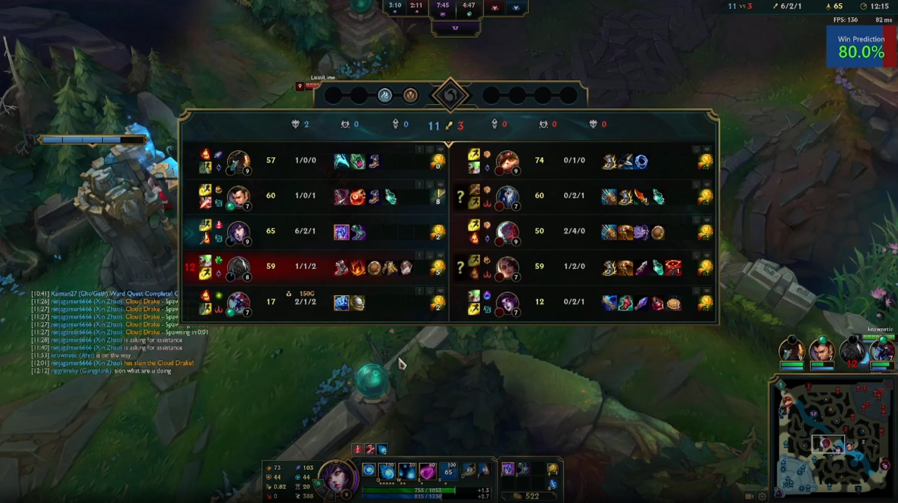
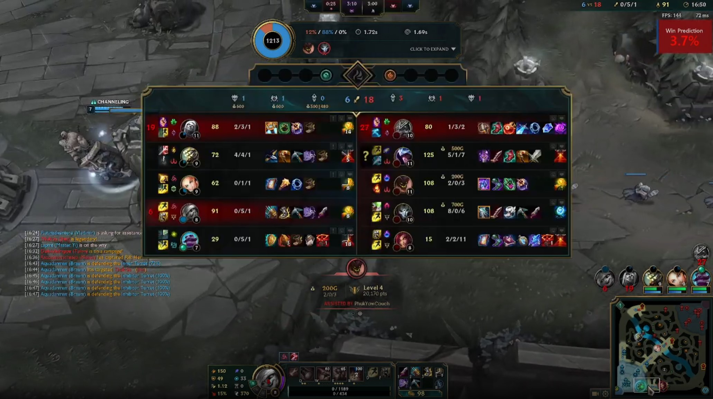
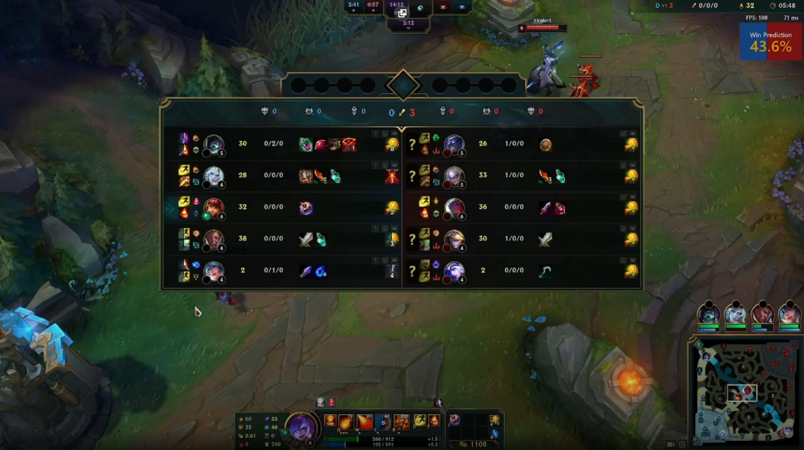
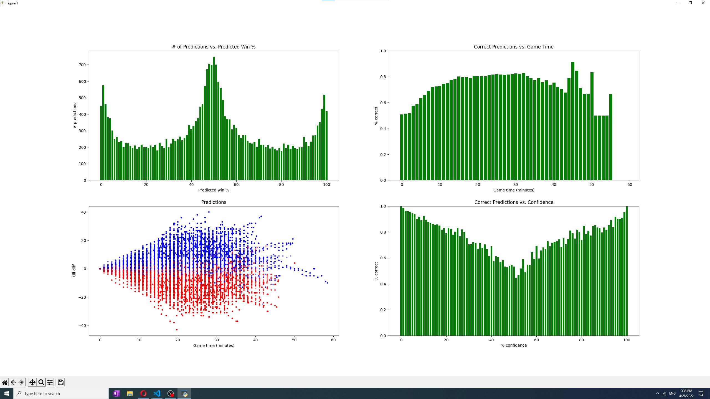

# League Win Predictor

*The only\* objective way to ff15*

You know those "who's winning" bars for games like Chess? Well, here's one for League of Legends! (Sort of.)

## Demo

[Brief Video Demo](https://i.gyazo.com/dfe958290a0a78d46770ed55c15ae6eb.mp4) *(Do Co-op vs. AI bots have souls?)*

*Popping off on Ahri*

*Inting on Tristana*

*Tossup (Maybe mid can carry... spoiler: nope)*

## Installation

Run this installer. (This app only works on Windows. Sorry Mac gamers :/)

## About

This is a tiny widget (or vertical bar on Mac) that displays your current probability of winning in real time. 

The predictions are generated by a plain logistic regression model. As input, the model is given:
- The current game time, in seconds
- The number of outer turrets, inner turrets, inhibitor turrets, inhibitors, and nexus turrets taken by each team
- The number of rift heralds, dragons (of all types), and barons killed by each team
- The current level, CS, and KDA of each champ
- [Champion ratings](https://leagueoflegends.fandom.com/wiki/List_of_champions/Ratings) for each of the teams
    - This is inputted as two numbers for each rating: One summing all the blue team's values, and one for the red team.
    - The intention here was to allow the model to learn the basics of team compositions. However, this input only led to a very slight improvement in the model's accuracy.

The model then outputs a single integer: The probabilty that the current player's team will win the game.

6706 matches scraped through [Riot's official developer API](https://developer.riotgames.com/) were used for training. Snapshots of each match were taken every minute - each of these were turned into test cases for the model. In total, there were 168158 training examples and 30085 test examples.

## Results

Training set accuracy: 72.9%
Test set accuracy: 73.1%

Overall, the model's accuracy rate is about **73%**. However, this is not equally distributed across game time, as seen in the illustration below (created using only the test set).

*Fancy graphs!*

## Development Setup

Warning: This project is very messy, there are lots of unused/old files everywhere and the Mac overlay (probably) doesn't work. Clone at your own risk!

See `requirements.txt` for a list of dependencies.

Run **overlay_predict_windows.py** or **overlay_predict_mac.py** to start the widget, depending on your OS.
